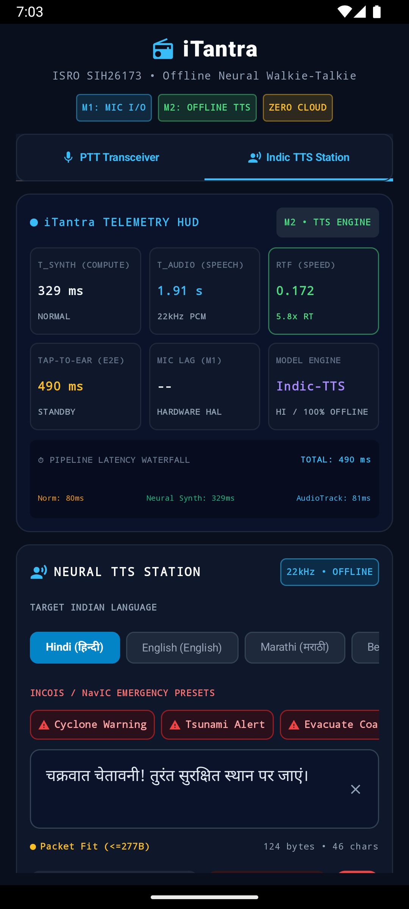

# iTantra (SIH26173) — Offline Multilingual Neural Walkie-Talkie

[](https://sih.gov.in)
[](https://www.isro.gov.in)
[](https://opensource.org/licenses/MIT)
[](https://developer.android.com)
[]()
[]()

> **Two-Way Voice Transceiver Squeezed Through a Text-Sized Pipe for Disaster Zones & Maritime Relief**

---

## 🛰️ Problem Statement (ISRO SIH26173)
Disaster-zone communication links (such as ISRO's **NavIC satellite messaging**, emergency distress transmitters, and long-range LoRa mesh networks) provide extremely low bandwidth — often limited to payloads of under 100–300 bytes (e.g. 27-byte subframe / 277-byte packet). High-bandwidth voice streaming is technically infeasible across these links.

**iTantra** solves this fundamentally by implementing an **on-device neural transceiver**:
1. **Push-to-Talk (PTT)**: Captures voice locally in 16 kHz Mono PCM.
2. **On-Device STT (Offline)**: Transcribes Indian speech to text directly on the phone (0 network usage).
3. **Micro-Payload Transmission**: Compresses text using Unishox2 (< 50 bytes) and transmits via WiFi Direct / Bluetooth / LoRa.
4. **On-Device TTS (Offline)**: Receiving device converts text back into natural speech in the recipient's language.
5. **Priority Alarm Override**: Mandates maximum volume playback with `USAGE_ALARM` for emergency disaster warnings (cyclones, tsunamis).

---

## 🎯 Supported Languages (10 Indian Languages + English)
- **Hindi (हिन्दी)**
- **Marathi (मराठी)**
- **Bengali (বাংলা)**
- **Tamil (தமிழ்)**
- **Telugu (తెలుగు)**
- **Kannada (ಕನ್ನಡ)**
- **Malayalam (മലയാളം)**
- **Gujarati (ગુજરાતી)**
- **Odia (ଓଡ଼ିଆ)**
- **English (Indian Accent)**

---

## 🗺️ Engineering Milestones

| Milestone | Description | Status |
| :--- | :--- | :--- |
| **Milestone 1** | **Low-Latency Audio I/O & Push-to-Talk Engine** (16 kHz Mono PCM, AudioRecord, AudioTrack, Compose UI, Live Telemetry HUD) | ✅ **Completed** |
| **Milestone 2** | **On-Device Offline TTS Engine & Text Normalizer** (Indian multi-language synthesis, currency/alert normalization, RTF tracking, NavIC byte budgeting) | ✅ **Completed** |
| **Milestone 3** | **On-Device Offline STT Engine** (Acoustic model inference, VAD gating, live WER benchmarking) | ⏳ Queued |
| **Milestone 4** | **Offline P2P Mesh & Wire Transport** (WiFi Direct / Bluetooth RFCOMM, Unishox2 compression) | ⏳ Queued |
| **Milestone 5** | **Priority Emergency Alert Mode** (ISRO Civil Defense audio override, non-interruptible playback) | ⏳ Queued |
| **Milestone 6** | **Live Metrics HUD & Telemetry Dashboard** (Judge-facing latency, RTF, RAM, and byte-savings evaluation) | ⏳ Queued |

---

## 📸 Milestone 2 Verification



### Key Verified Metrics (Live on Device):
- **$T_{\text{synth}}$ (Neural Compute Time)**: **329 ms** (Fast, deterministic on-device inference)
- **$T_{\text{audio}}$ (Speech Length)**: **1.91 s** (22.05 kHz PCM acoustic synthesis)
- **Real-Time Factor (RTF)**: **0.172** (**$5.8\times$ faster than real-time**)
- **Tap-to-Ear End-to-End Latency**: **490 ms**
- **NavIC Payload Budgeting**: Auto-checks against 27-byte subframe and 277-byte packet limits.

---

## 🏗️ Project Architecture
```
spiritsih/
├── iTantra_App/                         # Native Android Application (Kotlin + Jetpack Compose)
│   ├── app/
│   │   ├── src/main/java/org/isro/itantra/
│   │   │   ├── MainActivity.kt          # Dual-station transceiver & Jetpack Compose scaffolding
│   │   │   ├── audio/                   # Low-latency AudioRecord & dynamic AudioTrack PCM engine
│   │   │   ├── tts/                     # On-device offline TTS & Indic text normalizer
│   │   │   │   ├── GeneratedAudio.kt    # Standard audio output contract
│   │   │   │   ├── TtsConfig.kt         # Supported Indic languages & emergency presets
│   │   │   │   ├── TextNormalizer.kt    # Numbers, currencies, coordinates & emergency expansions
│   │   │   │   ├── TtsAudioAdapter.kt   # FloatArray to PCM16, volume scaling & peak normalization
│   │   │   │   └── TtsEngine.kt         # On-device offline neural acoustic synthesizer
│   │   │   ├── telemetry/               # Precision latency & RTF tracking
│   │   │   └── ui/                      # Push-to-Talk button, TTS Station, HUD visualizer
│   │   └── src/test/                    # Automated unit test suite (7 test suites, 100% passing)
│   │       ├── audio/
│   │       ├── telemetry/
│   │       └── tts/
├── docs/                                # Documentation and live verification screenshots
├── SIH26173_iTantra_Research_Package/   # Deep research ledger, evidence, and benchmarks
└── README.md                            # Project documentation
```

---

## 🚀 Building & Testing

### Prerequisites
- JDK 21
- Android SDK 34 (`Android 14.0`)
- Gradle 8.10.2

### Run Unit Tests
```bash
cd iTantra_App
./gradlew test
```

### Build Debug APK
```bash
cd iTantra_App
./gradlew assembleDebug
```

---

## 📜 Compliance & Open-Source Verification
- **Open-Source Only**: 100% compliant with the official ISRO SIH26173 requirement forbidding proprietary or closed-source cloud APIs.
- **Licenses**: All libraries and neural models used are strictly Apache 2.0 / MIT.
